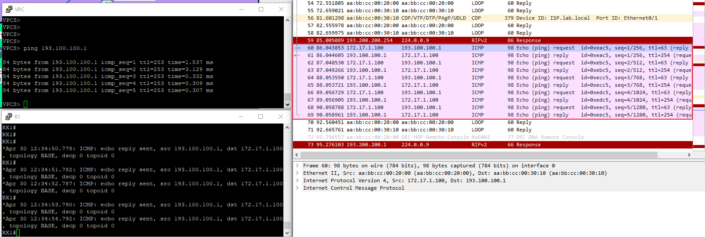
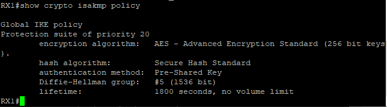
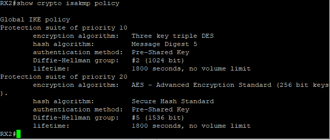
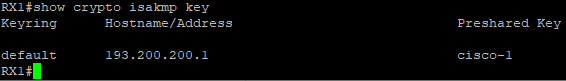
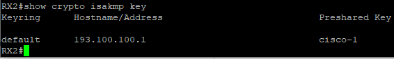
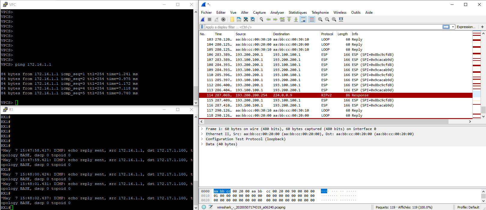
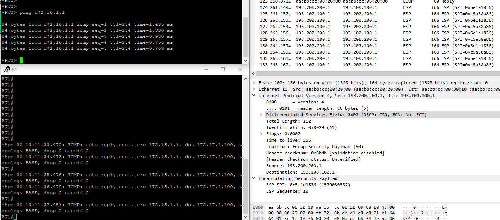
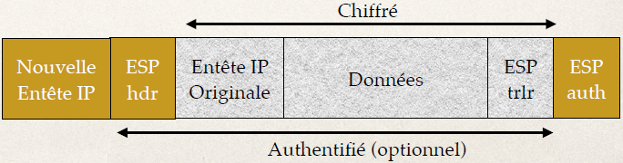

# Teaching-HEIGVD-SRX-2020-Laboratoire-VPN

***Auteur: Robin Müller, Stéphane Teixeira Carvalho***

**Ce travail de laboratoire est à faire en équipes de 3 personnes**

**Pour ce travail de laboratoire, il est votre responsabilité de chercher vous-même sur internet, le support du cours ou toute autre source (vous avez aussi le droit de communiquer avec les autres équipes), toute information relative au sujet VPN, le logiciel eve-ng, les routeur Cisco, etc que vous ne comprenez pas !**

**ATTENTION : Commencez par créer un Fork de ce repo et travaillez sur votre fork.**

Clonez le repo sur votre machine. Vous pouvez répondre aux questions en modifiant directement votre clone du README.md ou avec un fichier pdf que vous pourrez uploader sur votre fork.

**Le rendu consiste simplement à répondre à toutes les questions clairement identifiées dans le text avec la mention "Question" et à les accompagner avec des captures. Le rendu doit se faire par une "pull request". Envoyer également le hash du dernier commit et votre username GitHub par email au professeur et à l'assistant**

**N'oubliez pas de spécifier les noms des membres du groupes dans la Pull Request ainsi que dans le mail de rendu !!!**


## Echéance

Ce travail devra être rendu le dimanche après la fin de la 2ème séance de laboratoire, soit au plus tard, **le 11 mai 2020, à 23h59.**


## Introduction

Dans ce travail de laboratoire, vous allez configurer des routeurs Cisco émulés, afin de mettre en œuvre une infrastructure sécurisée utilisant des tunnels IPSec.

### Les aspects abordés

-	Contrôle de fonctionnement de l’infrastructure
-	Contrôle du DHCP serveur hébergé sur le routeur
-	Gestion des routeurs en console
-	Capture Sniffer avec filtres précis sur la communication à épier
-	Activation du mode « debug » pour certaines fonctions du routeur
-	Observation des protocoles IPSec


## Matériel

La manière la plus simple de faire ce laboratoire est dans les machines des salles de labo. Le logiciel d'émulation c'est eve-ng. Vous trouverez un [guide très condensé](files/Fonctionnement_EVE-NG.pdf) pour l'utilisation de eve-ng ici.

Vous pouvez faire fonctionner ce labo sur vos propres machines à condition de copier la VM eve-ng. A présent, la manière la plus simple d'utiliser eve-ng est de l'installer sur Windows (mais, il est possible de le faire fonctionner sur Mac OS et sur Linux...).

**Tuto d'installation** de la VM eve-ng : https://www.eve-ng.net/index.php/documentation/installation/virtual-machine-install/

**Récupération de la VM pré-configurée** (vous ne pouvez pas utiliser la versión qui se trouve sur le site de eve-ng) : vous la trouverez sur \\eistore1\cours\iict\SRX\LaboVPn

Il est conseillé de passer la VM en mode "Bridge" si vous avez des problèmes. Le mode NAT **devrait** aussi fonctionner.

Les user-password en mode terminal sont : "root" | "eve"

Les user-password en mode navigateur sont : "admin" | "eve"

Ensuite, terminez la configuration de la VM, connectez vous et récupérez l'adresse ip de la machine virtuelle.

Utilisez un navigateur internet (hors VM) et tapez l'adresse IP de la VM.


## Fichiers nécessaires

Tout ce qu'il vous faut c'est un [fichier de projet eve-ng](files/eve-ng_Labo_VPN_SRX.zip), que vous pourrez importer directement dans votre environnement de travail.


## Mise en place

Voici la topologie qui sera simulée. Elle comprend deux routeurs interconnectés par l'Internet. Les deux réseaux LAN utilisent les services du tunnel IPSec établi entre les deux routeurs pour communiquer.

Les "machines" du LAN1 (connecté au ISP1) sont simulées avec l'interface loopback du routeur. Les "machines" du LAN2 sont représentées par un seul ordinateur.  


Voici le projet eve-ng utilisé pour implémenter la topologie. Le réseau Internet (nuage) est simulé par un routeur.


## Manipulations

- Commencer par importer le projet dans eve-ng.
- Prenez un peu de temps pour vous familiariser avec la topologie présentée dans ce guide et comparez-la au projet eve-ng. Identifiez les éléments, les interconnexions et les adresses IPs.
- À tout moment, il vous est possible de sauvegarder la configuration dans la mémoire de vos routeurs :
	- Au Shell privilégié (symbole #) entrer la commande suivante pour sauvegarder la configuration actuelle dans la mémoire nvram du routeur : ```wr```
	- Vous **devez** faire des sauvegardes de la configuration (exporter) dans un fichier - c.f. [document guide eve-ng](files/Fonctionnement_EVE-NG.pdf)


### Vérification de la configuration de base des routeurs
Objectifs:

Vérifier que le projet a été importé correctement. Pour cela, nous allons contrôler certains paramètres :

- Etat des interfaces (`show interface`)
- Connectivité (`ping`, `show arp`)
- Contrôle du DHCP serveur hébergé sur R2


### A faire...

- Contrôlez l’état de toutes vos interfaces dans les deux routeurs et le routeur qui simule l'Internet - Pour contrôler l’état de vos interfaces (dans R1, par exmeple) les commandes suivantes sont utiles :

```
R1# show ip interface brief
R1# show interface <interface-name>
R1# show ip interface <interface-name>
```

Un « status » différent de `up` indique très souvent que l’interface n’est pas active.

Un « protocol » différent de `up` indique la plupart du temps que l’interface n’est pas connectée correctement (en tout cas pour Ethernet).

**Question 1: Avez-vous rencontré des problèmes ? Si oui, qu’avez-vous fait pour les résoudre ?**

---

Nous n'avons pas rencontré de problèmes. Tous les routeurs ont démarrés normalement et les configurations étaient correctes.
La seul différence est que le routeur R2 possèdait une interface loopback non-spécifié dans le schéma. Nous ne pensons toutefois pas que cela soit problématique pour le déroulement du laboratoire.

---


- Contrôlez que votre serveur DHCP sur R2 est fonctionnel - Contrôlez que le serveur DHCP préconfiguré pour vous sur R2 a bien distribué une adresse IP à votre station « VPC ».


Les commandes utiles sont les suivantes :

```
R2# show ip dhcp pool
R2# show ip dhcp binding
```

Côté station (VPC) vous pouvez valider les paramètres reçus avec la commande `show ip`. Si votre station n’a pas reçu d’adresse IP, utilisez la commande `ip dhcp`.

- Contrôlez la connectivité sur toutes les interfaces à l’aide de la commande ping.

Pour contrôler la connectivité les commandes suivantes sont utiles :

```
R2# ping ip-address
R2# show arp (utile si un firewall est actif)
```

Pour votre topologie il est utile de contrôler la connectivité entre :

- R1 vers ISP1 (193.100.100.254)
- R2 vers ISP2 (193.200.200.254)
- R2 (193.200.200.1) vers RX1 (193.100.100.1) via Internet
- R2 (172.17.1.1) et votre poste « VPC »

**Question 2: Tous vos pings ont-ils passé ? Si non, est-ce normal ? Dans ce cas, trouvez la source du problème et corrigez-la.**

---

Nous avons juste eu besoin de lancer la commande `ip dhcp` sur le VPC car il n'avait pas d'addresse IP définie. Une fois cela effectuée, tous les pings indiqué ci-dessus sont passés.

---

- Activation de « debug » et analyse des messages ping.

Maintenant que vous êtes familier avec les commandes « show » nous allons travailler avec les commandes de « debug ». A titre de référence, vous allez capturer les messages envoyés lors d’un ping entre votre « poste utilisateur » et un routeur. Trouvez ci-dessous la commande de « debug » à activer.

Activer les messages relatif aux paquets ICMP émis par les routeurs (repérer dans ces messages les type de paquets ICMP émis - < ICMP: echo xxx sent …>)

```
R2# debug ip icmp
```
Pour déclencher et pratiquer les captures vous allez « pinger » votre routeur R1 avec son IP=193.100.100.1 depuis votre « VPC ». Durant cette opération vous tenterez d’obtenir en simultané les informations suivantes :

-	Une trace sniffer (Wireshark) à la sortie du routeur R2 vers Internet. Si vous ne savez pas utiliser Wireshark avec eve-ng, référez-vous au document explicatif eve-ng. Le filtre de **capture** (attention, c'est un filtre de **capture** et pas un filtre d'affichage) suivant peut vous aider avec votre capture : `ip host 193.100.100.1`.
-	Les messages de R1 avec `debug ip icmp`.


**Question 3: Montrez vous captures**

---

La capture d'écran ci-dessous contient la console du VPC, la console de R1 ainsi qu'une capture wireshark sur l'interface de R2 vers internet.



On voit donc que le ping est envoyé depuis le VPC en transitant par R2(Echo request). R1 reçoit ensuite les echo requests et répond avec des echo reply. Ces paquets sont également reçus par R2 il est possible de voir cela sur la capture ci-dessus(Echo reply).

Nous avons donc la confirmation que la communication se passe correctement.

---

## Configuration VPN LAN 2 LAN

**Il est votre responsabilité de chercher vous-même sur internet toute information relative à la configuration que vous ne comprenez pas ! La documentation CISCO en ligne est extrêmement complète et le temps pour rendre le labo est plus que suffisant !**

Nous allons établir un VPN IKE/IPsec entre le réseau de votre « loopback 1 » sur R1 (172.16.1.0/24) et le réseau de votre « VPC » R2 (172.17.1.0/24). La terminologie Cisco est assez « particulière » ; elle est listée ici, avec les étapes de configuration, qui seront les suivantes :

- Configuration des « proposals » IKE sur les deux routeurs (policy)
- Configuration des clefs « preshared » pour l’authentification IKE (key)
- Activation des « keepalive » IKE
- Configuration du mode de chiffrement IPsec
- Configuration du trafic à chiffrer (access list)
- Activation du chiffrement (crypto map)


### Configuration IKE

Sur le routeur R1 nous activons un « proposal » IKE. Il s’agit de la configuration utilisée pour la phase 1 du protocole IKE. Le « proposal » utilise les éléments suivants :

| Element          | Value                                                                                                        |
|------------------|----------------------------------------------------------------------------------------------------------------------|
| Encryption       | AES 256 bits    
| Signature        | Basée sur SHA-1                                                                                                      |
| Authentification | Preshared Key                                                                                                        |
| Diffie-Hellman   | avec des nombres premiers sur 1536 bits                                                                              |
| Renouvellement   | des SA de la Phase I toutes les 30 minutes                                                                           |
| Keepalive        | toutes les 30 secondes avec 3 « retry »                                                                              |
| Preshared-Key    | pour l’IP du distant avec le texte « cisco-1 », Notez que dans la réalité nous utiliserions un texte plus compliqué. |


Les commandes de configurations sur R1 ressembleront à ce qui suit :

```
crypto isakmp policy 20
  encr aes 256
  authentication pre-share
  hash sha
  group 5
  lifetime 1800
crypto isakmp key cisco-1 address 193.200.200.1 no-xauth
crypto isakmp keepalive 30 3
```

Sur le routeur R2 nous activons un « proposal » IKE supplémentaire comme suit :

```
crypto isakmp policy 10
  encr 3des
  authentication pre-share
  hash md5
  group 2
  lifetime 1800
crypto isakmp policy 20
  encr aes 256
  authentication pre-share
  hash sha
  group 5
  lifetime 1800
crypto isakmp key cisco-1 address 193.100.100.1 no-xauth
crypto isakmp keepalive 30 3
```

Vous pouvez consulter l’état de votre configuration IKE avec les commandes suivantes. Faites part de vos remarques :

**Question 4: Utilisez la commande `show crypto isakmp policy` et faites part de vos remarques :**

---

La commande permet de voir les policy que nous avons mis en place grâce à la commande `crypto isakmp policy numéro_policy`. On peut donc constater que ce que nous avons comme résultat est bien celui désiré en comparaison avec le tableau représenté ci-dessus.

Voici le résultat pour le routeur R1 et R2 :





Nous avons ajoutés une policy supplémentaire pour le routeur R2 avec comme chiffrement l'algorithme triple DES avec une priorité plus haute(`10`) mais comme le routeur R1 n'utilise que l'encryption AES seul la policy 20 va être utilisée pour mettre en place l'IKE.  
En plus de cela la policy 10 n'est pas très performante car nous utilisons du triple DES qui est nettement plus lent qu'AES. Elle n'est aussi pas très fiable car nous utilisons md5 qui est déprécié pour ce genre d'échange. La clé Diffie-Hellman est également plus petite 1024 bit(`group 2`) ce qui est également déprecié.

De nos jours la configuration Diffie-Hellman mise en place sur la policy 10 est également dépricé car il est conseillé d'avoir au minimum une clé de 2048 bits.

---


**Question 5: Utilisez la commande `show crypto isakmp key` et faites part de vos remarques :**

---

Cette commande permet de voir les clés pré-partagées configurées sur un routeur. Voici le résultat pour les 2 routeurs R2 et R1:




On peut donc voir que la clé par défaut `cisco-1` est configuré sur les 2 routeurs. Les routeurs auront donc la même clé cela est obligatoire pour utiliser le mode `pre-shared`. Ces clés vont nous permettre d'avoir un secret, en plus du secret partagées avec Diffie-Hellman, entre les 2 routeurs pour vérifier l'autentification entre ceux-ci. Si la clé partagée est retrouvée dans le paquet reçu par un des routeur on sait que le paquet est authentique.    
Cette technique a des défauts car si nous avons N routeurs différents nous devrions avoir les clés des N routeurs avec qui nous voulons mettre en place IKE ce qui n'est pas très pratique.

Les Hostname permettent de définir que tout paquet, ayant comme direction l'adresse IP définie, doit être chiffré avec la clé définie.

---

## Configuration IPsec

Nous allons maintenant configurer IPsec de manière identique sur les deux routeurs. Pour IPsec nous allons utiliser les paramètres suivants :

| Paramètre      | Valeur                                  |
|----------------|-----------------------------------------|
| IPsec avec IKE | IPsec utilisera IKE pour générer ses SA |
| Encryption     | AES 192 bits                            |
| Signature      | Basée sur SHA-1                         |
| Proxy ID R1    | 172.16.1.0/24                           |
| Proxy ID R2    | 172.17.1.0/24                           |

Changement de SA toutes les 5 minutes ou tous les 2.6MB

Si inactifs les SA devront être effacés après 15 minutes

Les commandes de configurations sur R1 ressembleront à ce qui suit :

```
crypto ipsec security-association lifetime kilobytes 2560
crypto ipsec security-association lifetime seconds 300
crypto ipsec transform-set STRONG esp-aes 192 esp-sha-hmac
  ip access-list extended TO-CRYPT
  permit ip 172.16.1.0 0.0.0.255 172.17.1.0 0.0.0.255
crypto map MY-CRYPTO 10 ipsec-isakmp
  set peer 193.200.200.1
  set security-association idle-time 900
  set transform-set STRONG
  match address TO-CRYPT
```

Les commandes de configurations sur R2 ressembleront à ce qui suit :

```
crypto ipsec security-association lifetime kilobytes 2560
crypto ipsec security-association lifetime seconds 300
crypto ipsec transform-set STRONG esp-aes 192 esp-sha-hmac
  mode tunnel
  ip access-list extended TO-CRYPT
  permit ip 172.17.1.0 0.0.0.255 172.16.1.0 0.0.0.255
crypto map MY-CRYPTO 10 ipsec-isakmp
  set peer 193.100.100.1
  set security-association idle-time 900
  set transform-set STRONG
  match address TO-CRYPT
```

Vous pouvez contrôler votre configuration IPsec avec les commandes suivantes :

```
show crypto ipsec security-association
show crypto ipsec transform-set
show access-list TO-CRYPT
show crypto map
```

## Activation IPsec & test

Pour activer cette configuration IKE & IPsec il faut appliquer le « crypto map » sur l’interface de sortie du trafic où vous voulez que l’encryption prenne place.

Sur R1 il s’agit, selon le schéma, de l’interface « Ethernet0/0 » et la configuration sera :

```
interface Ethernet0/0
  crypto map MY-CRYPTO
```

Sur R2 il s’agit, selon le schéma, de l’interface « Ethernet0/0 » et la configuration sera :

```
interface Ethernet0/0
  crypto map MY-CRYPTO
```


Après avoir entré cette commande, normalement le routeur vous indique que IKE (ISAKMP) est activé. Vous pouvez contrôler que votre « crypto map » est bien appliquée sur une interface avec la commande `show crypto map`.

Pour tester si votre VPN est correctement configuré vous pouvez maintenant lancer un « ping » sur la « loopback 1 » de votre routeur RX1 (172.16.1.1) depuis votre poste utilisateur (172.17.1.100). De manière à recevoir toutes les notifications possibles pour des paquets ICMP envoyés à un routeur comme RX1 vous pouvez activer un « debug » pour cela. La commande serait :

```
debug ip icmp
```

Pensez à démarrer votre sniffer sur la sortie du routeur R2 vers internet avant de démarrer votre ping, collectez aussi les éventuels messages à la console des différents routeurs.

**Question 6: Ensuite faites part de vos remarques dans votre rapport. :**

---
Lors de la configuration nous avons obtenus les warnings suivants :

```
Warning! Lifetime value of 2560 KB is lower than the recommended optimum value of 102400 KB
Warning! Lifetime value of 300 sec is lower than the recommended optimum value of 900 sec
```

Ces 2 warnings nous indiquent que les valeurs que nous avons choisis pour le temps de vie d'une SA sont trop basses. A cause de cela, nous changeront donc très souvent de SA ce qui n'est pas très optimisée mais dans le cadre du labo nous pensons que cela ne dérange pas.

Nous avons ensuite testé notre configuration en effectuant un ping de la mahcine VPC vers l'adresse de loopback du routeur R1.  
La capture d'écran contient la console du VPC, de R1 et une capture wireshark à la sortie de R2 vers internet.



On voit donc que, contrairement à la question 3, il n'y a plus de paquets ICMP mais des paquets utilisant le protocole ESP.  
Le ping fonctionne et on voit les messages de debug sur R1. Cela nous prouve donc que nos paquets sont chiffré et que IPSec a bien été mis en place.

Nous pouvons pousser la vérification en allant regarder les configuartions de routeurs. Voici la configuration pour le routeur R2 :
```
RX2#show crypto map
Crypto Map IPv4 "MY-CRYPTO" 10 ipsec-isakmp
        Peer = 193.100.100.1
        Extended IP access list TO-CRYPT
            access-list TO-CRYPT permit ip 172.17.1.0 0.0.0.255 172.16.1.0 0.0.0.255
        Current peer: 193.100.100.1
        Security association lifetime: 2560 kilobytes/300 seconds
        Security association idletime: 900 seconds
        Responder-Only (Y/N): N
        PFS (Y/N): N
        Mixed-mode : Disabled
        Transform sets={
                STRONG:  { esp-192-aes esp-sha-hmac  } ,
        }
        Interfaces using crypto map MY-CRYPTO:
                Ethernet0/0

        Interfaces using crypto map NiStTeSt1:
```
Grâce aux résultats ci-dessus nous voyons donc que la configuration IPSec que nous avons définie est bien défine sur l'interface e0/0 du routeur. La même vérification a été effectuée sur R1.
```
RX1#show crypto map
Crypto Map IPv4 "MY-CRYPTO" 10 ipsec-isakmp
        Peer = 193.200.200.1
        Extended IP access list TO-CRYPT
            access-list TO-CRYPT permit ip 172.16.1.0 0.0.0.255 172.17.1.0 0.0.0.255
        Current peer: 193.200.200.1
        Security association lifetime: 2560 kilobytes/300 seconds
        Security association idletime: 900 seconds
        Responder-Only (Y/N): N
        PFS (Y/N): N
        Mixed-mode : Disabled
        Transform sets={
                STRONG:  { esp-192-aes esp-sha-hmac  } ,
        }
        Interfaces using crypto map MY-CRYPTO:
                Ethernet0/0

        Interfaces using crypto map NiStTeSt1:
```

Nous pouvons alors confirmer que notre configuration VPN est fonctionnelle.

---

**Question 7: Reportez dans votre rapport une petite explication concernant les différents « timers » utilisés par IKE et IPsec dans cet exercice (recherche Web). :**

---

Deux différents « timers » sont utilisés par IKE et 2 autres timers sont utilisés par IPsec.

Un des timers de IKE est la `lifetime`, il est utilisé afin de renégocier les SA de la phase I. Notre configuration le définit à 30 minutes. Ce qui indique alors que au bout de 30 minutes une nouvelle SA est renégociée.  
Le second timer de IKE est nommé `keepalive`, c'est un timer qui permet de supprimer les SA si aucun paquet n'est transmis dans l'intervalle de temps. Notre configuration est toute les 30 secondes avec 3 essais.

Le premier timer `lifetime` de IPsec changer les SA toutes les 5 minutes (ou après 2.6MB de donnée transitée). Le second timer `idle-time` est utilisé afin de supprimer les SA en cas d'inactivité. Notre configuration les supprime après 15 minutes.

---


# Synthèse d’IPsec

En vous appuyant sur les notions vues en cours et vos observations en laboratoire, essayez de répondre aux questions. À chaque fois, expliquez comment vous avez fait pour déterminer la réponse exacte (capture, config, théorie, ou autre).


**Question 8: Déterminez quel(s) type(s) de protocole VPN a (ont) été mis en œuvre (IKE, ESP, AH, ou autre).**

---

IKE a été utilisé pour la mise en place de l'échange de clé. Nous pouvons confirmer cela car les commandes `crypto isakmp` que nous avons tapées permettent de définir et mettre en place IKE.

Nous avons également utilisé ESP pour le chiffrement de la payload du paquet transmis sur le réseau. Nous avons pu vérifier cela grâce à la capture prise lors de la question 6 mais également car nous avons effectuée la commande `crypto ipsec transform-set STRONG esp-aes 192 esp-sha-hmac` qui dans les 2 cas(chiffrement et authentification) utilise ESP.

---


**Question 9: Expliquez si c’est un mode tunnel ou transport.**

---

Nous avons configuré le mode tunnnel au moment de la commande `crypto ipsec` pour mettre en place IPSec.

    crypto ipsec transform-set STRONG esp-aes 192 esp-sha-hmac
      mode tunnel

Comme cette commande a été lancée sur le routeur R2, le routeur R1 va également l'utilsé lors de la communication. Ils vont décidé de cela lors de la transmission des possibilités de chaque routeur dans la phase 2 d'IKE.
Nous aurons donc un mode tunnel.

Il est également possible de voir que c'est bien le mode tunnel qui est utilisé en regardant les paquets avec l'aide de Wireshark. Il est possible de constater que l'entête IP a été modifié, L'adresse de source et de destination du paquet de base ont été modifiées.



---


**Question 10: Expliquez quelles sont les parties du paquet qui sont chiffrées. Donnez l’algorithme cryptographique correspondant.**

---

Tout le contenu original du paquet est chiffré(Entête IP, entête TCP et les données). Nous pouvons affirmer cela car comme nous avons vu en cours quand nous utilisons le mode Tunnel(ce qui est le cas ici) tout le paquet IP original est chiffré.

Le chiffrement utilisé est AES-192 ce qui nous indique que nous uilisons AES avec une clé de 192 bits.

Nous pouvons affirmer cela car nous avons définie cela avec la commande crypto `ipsec transform-set STRONG esp-aes 192 esp-sha-hmac`

---


**Question 11: Expliquez quelles sont les parties du paquet qui sont authentifiées. Donnez l’algorithme cryptographique correspondant.**

---

Encore une fois comme nous utilisons le mode Tunnel tout le paquet initial va être authentifié ainsi que le header ESP. Comme nous utilisons ESP nous avons repris le schéma du cours pour répondre à cette question. Ce schéma démontre bien les parties du paquets qui sont authentifiés.



Pour l'authentification nous avons mis en place l'algorithme `HMAC-SHA1`. Nous pouvons confirmer cela car nous avons l'avons indiqué avec la commande `crypto ipsec transform-set STRONG esp-aes 192 esp-sha-hmac`.

---


**Question 12: Expliquez quelles sont les parties du paquet qui sont protégées en intégrité. Donnez l’algorithme cryptographique correspondant.**

---

Toutes les parties du paquets vont être intègre sauf la nouvelle entête IP. Donc tout les parties du paquet qui sont authentifiées.  
Le protocol utilisé est le même que pour l'autentification(`HMAC-SHA1`) et cela va permettre de mettre en place la partie ICV(Integrity Check Value) dans le paquet IP pour vérifier l'intégrité de celui-ci(s'appelle ESP auth sur le schéma de la question 11).

---
